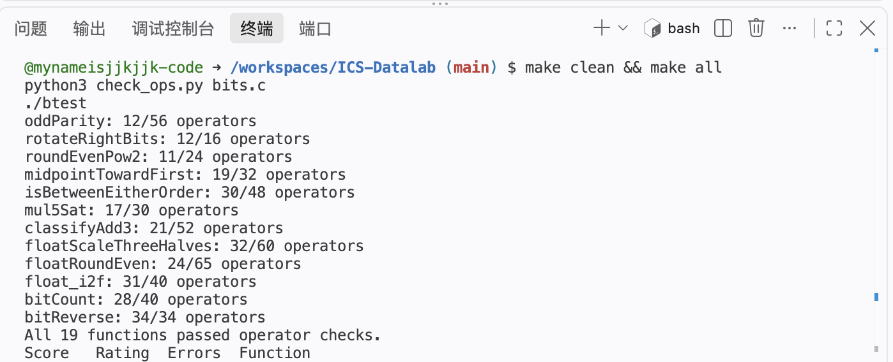
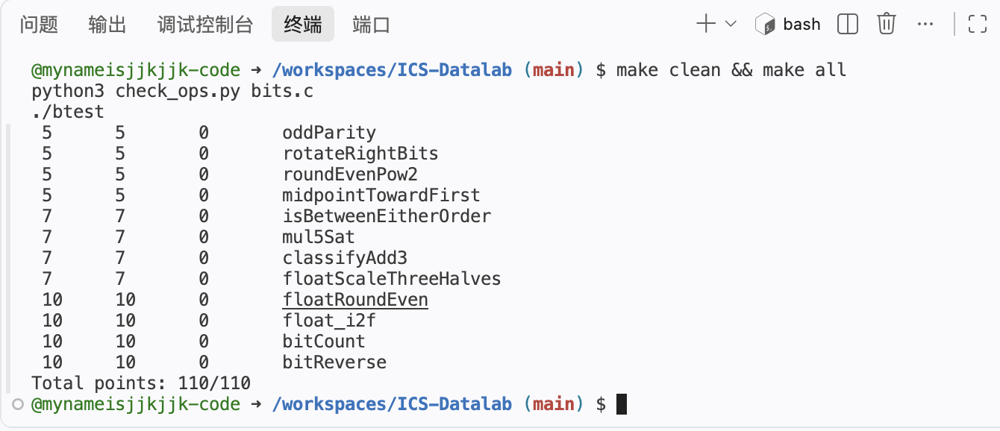

# Lab1：DataLab 实验报告

- 姓名：姬健坤
- 学号：23301030045
- GitHub 用户名：mynameisjjkjjk-code
- 仓库：https://github.com/mynameisjjkjjk-code/ICS-Datalab
- 实验日期：2026 年 9 月 30 日至 10 月 1 日
- 正式测试环境：GitHub Codespaces Linux，安装 gcc-multilib 和 libc6-dev-i386，使用原始 Makefile 构建。

## 一、实验目标与规则

完成 bits.c 中 P1–P19 的函数体，练习 32 位补码、掩码、移位、溢出判断以及 IEEE 754 单精度浮点数表示和舍入。

整数题只使用题目允许的运算符、0–255 的常量和 int 局部变量，不使用条件语句、循环或类型转换。bitXor 进一步限制为只使用 ~ 和 &。浮点题通过 int/unsigned 操作编码，允许控制流，但不使用浮点运算、类型转换或函数调用。函数签名、测试文件和自动评分配置保持模板原样。

## 二、各函数的实现思路

### P1 signMask

将常量 1 左移 31 位，得到仅最高位为 1 的掩码。这里使用题目规定的 32 位位向量模型。

### P2 bitXor

异或要求两个对应位不同才为 1。表达式 ~(x & y) 排除两个位均为 1 的情况，~(~x & ~y) 排除两个位均为 0 的情况，再将两者按位与，得到异或结果，全程只使用 ~ 和 &。

### P3 negativePart

算术右移 x >> 31 把符号扩展为全 0 或全 1 的掩码。补码取负用 ~x + 1 表示，再与符号掩码相与：非负输入得到 0，负输入得到其取负的位模式。INT_MIN 取负时按题目模型保留低 32 位，仍为 0x80000000。

### P4 copyByteWithin

将字节编号左移 3 位得到位偏移。先右移并与 255 提取源字节，再清除目标字节位置，最后把源字节左移到目标位置并按位或。提取发生在覆盖之前，因此 src 与 dst 相同时也正确。

### P5 logicalShift

先使用算术右移，再用低 32-n 位为 1 的掩码去掉符号扩展。掩码由最高位 1 算术右移 n 位、左移 1 位并取反构造。n=0 时掩码为全 1，n=31 时掩码为 1，避免了移位 32 位。

### P6 swapNibblePairs

从常量 15 构造 0x0f0f0f0f，提取每个字节的低四位并左移四位；另一部分先右移四位再与该掩码相与，得到原来的高四位。两部分按位或完成各字节内部高低半字节交换。

### P7 secondLowestZeroBit

x | (x + 1) 将最低的一个 0 置为 1，同时保留其余位，记为 filled。随后用 ~filled & (filled + 1) 提取 filled 最低的 0，它就是原输入第二低的 0。输入不足两个 0 时，结果为 0。

### P8 oddParity

依次将 x 与右移 16、8、4、2、1 位的自身异或，将全部位的异或结果折叠到最低位。最低位为 1 表示原数含奇数个 1，最后取反得到题目要求的奇校验位：偶数个 1 返回 1，奇数个 1 返回 0。

### P9 rotateRightBits

用 n & 31 计算实际移位量。右移部分用掩码实现逻辑右移，移出的低位用左移放到高位，再将两部分按位或。左移量使用 (~shift + 1) & 31，确保实际移位量为 0 时不会发生移位 32 位。

### P10 roundEvenPow2

设 half=2^(n-1)，odd 为整数商 x>>n 的最低位。先给 x 加上 half-1+odd，再右移 n 位并左移 n 位得到倍数。余数小于半程时不进位，大于半程时进位；恰好半程时仅在原商为奇数时进位，因此最终商为偶数。题目的 x 和 n 范围保证这里的加法不溢出。

### P11 midpointTowardFirst

用 (x & y) + ((x ^ y) >> 1) 计算向下取整的中点，避免直接求 x+y 的溢出。当和为奇数且 x>y 时，向下取整结果加 1，使其靠近第一个参数 x。判断大小时先看符号是否不同；符号相同时才使用差值的符号，避免用可能溢出的差值作决定。

### P12 isBetweenEitherOrder

分别计算 x<a 与 x<b 的全位掩码。比较时异号输入由符号决定，同号输入由差值符号决定。两个比较结果不同意味着 x 位于两个端点之间，但需要额外纳入 x==a 和 x==b，保证区间两端闭合，也覆盖 a==b 的情况。最后用两次逻辑非把结果归一化为 0 或 1。

### P13 mul5Sat

通过加法依次得到 2x、4x 和 5x。将三个中间结果与原数异或后检查符号位，捕获中间翻转以及最终加法导致的溢出。若溢出，按照原数符号选择 INT_MAX 或 INT_MIN；否则保留 5x。选择过程通过全位掩码完成，不使用分支。

### P14 classifyAdd3

把每个输入拆成算术右移两位得到的高部和最低两位得到的余数。先累加余数，再将其进位加到三个高部之和，得到 high=floor((x+y+z)/4)。高部累加不会超出 int 范围。

原始和不溢出的条件为 high 位于 [-2^29, 2^29-1]。比较 high>>29 和 high 的符号扩展：相同表示没有溢出，不同表示溢出。最后按 high 的符号返回 1 或 -1，没有溢出则返回 0。这种拆分也能处理两次加法中溢出相互抵消的情况。

### P15 floatScaleThreeHalves

拆出符号位、阶码和尾数字段。NaN 和无穷大直接原样返回。规格化数补上隐藏的最高位 1，非规格化数使用等效阶码 1 参与尾数计算。

将有效数用 sig+(sig<<1) 精确乘 3，然后根据大小右移 1 或 2 位，并相应调整阶码，实现乘以 3/2。根据丢弃部分与半程的比较，以及保留部分最低位的奇偶，实施最近偶数舍入。再处理舍入进位、非规格化数转规格化数和阶码溢出。正零、负零及结果符号均保留。

### P16 floatRoundEven

根据阶码分类。阶码至少为 150 时，有限数已没有小数部分；这一分支同时使 NaN 和无穷大保持原样。阶码小于 126 时绝对值小于 0.5，返回带原符号的零。阶码为 126 时，恰好 0.5 舍入到零，大于 0.5 则舍入到带符号的 1。

其余输入根据 150-exp 确定小数位数，清除这些位，并比较丢弃部分和半程；超过半程或中点处整数为奇数时，在对应位加 1，实现最近偶数舍入。

### P17 float_i2f

先保存符号，并在 unsigned 中计算幅值，避免 INT_MIN 的幅值无法用正 int 表示的问题。找到最高有效位，确定阶码。有效位不超过 24 位时左移对齐，可以精确表示；否则保留最高 24 位，并根据剩余位实施最近偶数舍入。若舍入使有效数进位，再右移一次并增加阶码，最后组合符号、阶码和尾数字段。

### P18 bitCount

构造 0x55555555、0x33333333 和 0x0f0f0f0f 掩码。先将相邻单个位合并成每两位的计数，再合并成每四位、每八位的计数。之后通过右移 8 位和 16 位进行汇总，最低六位足够表示 0–32 的最终计数。

### P19 bitReverse

依次交换高低 16 位、相邻字节、相邻半字节、相邻两位和相邻单个位。起始掩码为 0x0000ffff，通过 mask ^ (mask << k) 依次生成 0x00ff00ff、0x0f0f0f0f、0x33333333、0x55555555。每轮用掩码消除算术右移产生的多余位，将两部分交换后合并。该实现使用 34 个运算符，恰好满足上限。

## 三、测试过程与结果

在 Codespaces 的仓库目录安装实验依赖后执行：

```bash
make clean && make all
python3 check_ops.py bits.c
./btest
```

规则检查结果为 `All 19 functions passed operator checks.`，说明所有函数的运算符与操作数符合要求；正确性测试结果为 `Total points: 110/110`。

### 运算符检查截图



### 正确性测试截图



以上截图来自实际 Codespaces 终端，截图保留了结果汇总及后半部分函数输出。

## 四、参考资料

- [课程 Lab1：DataLab 实验说明](https://ics-26fall-fdu.github.io/labs/lab1-data-lab/)。
- [课程 DataLab 模板仓库](https://github.com/ICS-26Fall-FDU/DataLab)：README.md、bits.c 题目注释，以及配套检查器和测试程序。
